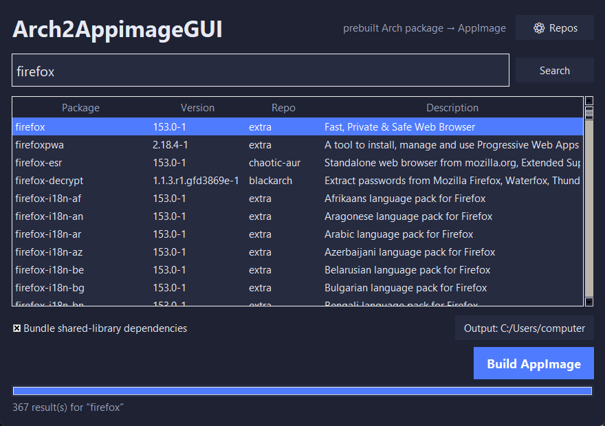

# Arch2AppimageGUI

Search prebuilt **Arch Linux** binary repositories and turn any package into a
self-contained **AppImage** — with one click.

No pacman. No compiling. No Arch install required. Arch2AppimageGUI pulls
packages straight from the mirrors as `.pkg.tar.zst`, bundles their
shared-library dependencies, and hands the result to `appimagetool`. It runs on
**any Linux distro**.

  



*Searching “firefox” across all eight repositories at once — every result is a
prebuilt binary, one click from becoming an AppImage.*

---

## What it does

1. **Search** a merged index across every enabled prebuilt-binary repo.
2. Pick a package and click **Build AppImage**.
3. Arch2AppimageGUI resolves the dependency closure, downloads the package plus
   the libraries it needs, assembles an AppDir, prunes the libraries that must
   come from the host (glibc, the GPU driver, etc.), writes a
   `.desktop`/icon/`AppRun`, and runs `appimagetool`.
4. Out comes `name-version-x86_64.AppImage`.

Because search only covers repos that ship **prebuilt binaries**, every result
is genuinely one-click buildable — no dead ends where a package would need to be
compiled from source.

## Repositories

All eight are **enabled by default** (toggle any of them in **⚙ Repos**). Every
one ships **prebuilt binaries**, so nothing is ever compiled from source. Package
counts below are approximate (x86_64, at the time of writing) — together they
index **~30,000 packages**.

| Repo | What's in it | ~Packages | Database |
|------|--------------|----------:|----------|
| **core** | Official Arch — base system | 300 | `geo.mirror.pkgbuild.com/core/os/x86_64` |
| **extra** | Official Arch — the main desktop/app set | 14,900 | `geo.mirror.pkgbuild.com/extra/os/x86_64` |
| **multilib** | Official Arch — 32-bit compatibility | 270 | `geo.mirror.pkgbuild.com/multilib/os/x86_64` |
| **chaotic-aur** | Popular AUR packages, prebuilt | 3,200 | `cdn-mirror.chaotic.cx/chaotic-aur/x86_64` |
| **archlinuxcn** | Large community binary repo | 4,800 | `repo.archlinuxcn.org/x86_64` |
| **arch4edu** | Science / education / CUDA / ROCm | 1,600 | `mirrors.tuna.tsinghua.edu.cn/arch4edu/x86_64` |
| **blackarch** | Security & pentest tools | 5,000 | `ftp.halifax.rwth-aachen.de/blackarch/blackarch/os/x86_64` |
| **archstrike** | Security / forensics | 750 | `mirror.archstrike.org/x86_64/archstrike` |

Deliberately **excluded**: distro repos (Manjaro, Garuda, EndeavourOS) drift from
Arch package versions and cause dependency skew; optimized rebuilds (ALHP,
CachyOS) add no new packages, only recompiled ones.

Adding another prebuilt-binary repo is one entry in
[`a2a/config.py`](a2a/config.py) — a name, its `.db` URL, and (optionally) a
package base URL. The `.db` and package files live in the same directory in a
pacman repo, so the base URL is derived automatically.

## Requirements

- **Linux** (x86_64). The build step assembles Linux binaries, so it must run on
  Linux — WSL2 works too.
- **Python 3.9+** with Tk (`tkinter`) for the GUI. Most distros ship this as
  `python3-tk` / `tk`.
- A way to read `.pkg.tar.zst`, in order of preference (Arch2AppimageGUI picks
  whatever is available):
  - Python **3.14+** (native zstd in `tarfile`), **or**
  - the [`zstandard`](https://pypi.org/project/zstandard/) module, **or**
  - `bsdtar` (`libarchive`) / `zstd` on `PATH`.
- `appimagetool` is downloaded automatically and run with
  `--appimage-extract-and-run`, so **FUSE is not required**.

## Download

Prebuilt, self-contained binaries are attached to every
[release](https://github.com/Captain-Beefheart/Arch2AppimageGUI/releases/latest):

| Platform | File | Notes |
|----------|------|-------|
| **Linux** | `Arch2AppimageGUI-x86_64.AppImage` | Bundles its own Python + Tk. `chmod +x` and run. |
| **Windows** | `Arch2AppimageGUI.exe` | Single-file GUI. *(The build itself targets Linux — see below.)* |

> **Note:** the Windows `.exe` runs the search/UI, but **assembling an AppImage
> requires a Linux userland**, so the actual build step needs Linux (or WSL2).
> The Linux AppImage is the fully self-contained option.

## Install & run (from source)

```bash
git clone https://github.com/Captain-Beefheart/Arch2AppimageGUI
cd Arch2AppimageGUI
./run.sh                 # launches the GUI
```

or directly:

```bash
python3 Arch2AppimageGUI.py         # GUI
```

## Command line

The same engine is available headless:

```bash
./run.sh search firefox                 # search all enabled repos
./run.sh build firefox                  # build ~/firefox-*.AppImage
./run.sh build mpv --repo chaotic-aur -o ~/AppImages
./run.sh build htop --no-deps           # don't bundle dependencies
./run.sh repos                          # list configured repos
./run.sh sync --force                   # refresh the repo databases
```

## How dependency bundling works

Arch2AppimageGUI resolves each package's `%DEPENDS%` transitively and downloads
the dependency packages, **except** the parts of every Linux userland that are
guaranteed to be present (glibc, gcc-libs, coreutils, …). After extraction it
prunes any remaining libraries on the AppImage
[excludelist](https://github.com/AppImage/pkg2appimage/blob/master/excludelist)
— libraries that are tightly coupled to the host kernel, loader, or GPU driver
and must not be shipped. `AppRun` then points `LD_LIBRARY_PATH` at the bundled
libraries, falling back to the host for the pruned ones.

This is the same philosophy as `pkg2appimage`, adapted to work from package
metadata so it doesn't depend on the target libraries being installed on the
build host.

> **Note:** bundling is best-effort. Some large or deeply integrated
> applications (heavy GTK/Qt stacks, anything poking at system services) may need
> tweaks. Uncheck *Bundle dependencies* to produce a lean AppImage that relies on
> the host's libraries, which is often all you need on a full desktop.

## Caching

- Repo databases: `~/.cache/arch2appimage/db/`
- Downloaded packages: `~/.cache/arch2appimage/pkg/`
- `appimagetool`: `~/.cache/arch2appimage/tool/`
- Config: `~/.config/arch2appimage/config.json`

Databases refresh automatically after 12 hours (configurable), or immediately
with `sync --force`.

## Project layout

```
Arch2AppimageGUI.py         entry point (GUI with no args, CLI with args)
run.sh                      launcher
a2a/
  config.py                 repo definitions + persisted settings
  repos.py                  download + parse pacman .db, build/search index
  deps.py                   transitive dependency resolution
  extract.py                .pkg.tar.zst extraction (zstd fallback chain)
  excludelist.py            host-provided libraries not to bundle
  appdir.py                 AppDir assembly (.desktop, icon, AppRun, prune)
  appimage.py               fetch + run appimagetool
  builder.py                the one-click pipeline
  cli.py                    command-line interface
gui/
  arch2appimage_gui.py      Tk GUI
```

## License

MIT — see [LICENSE](LICENSE).
